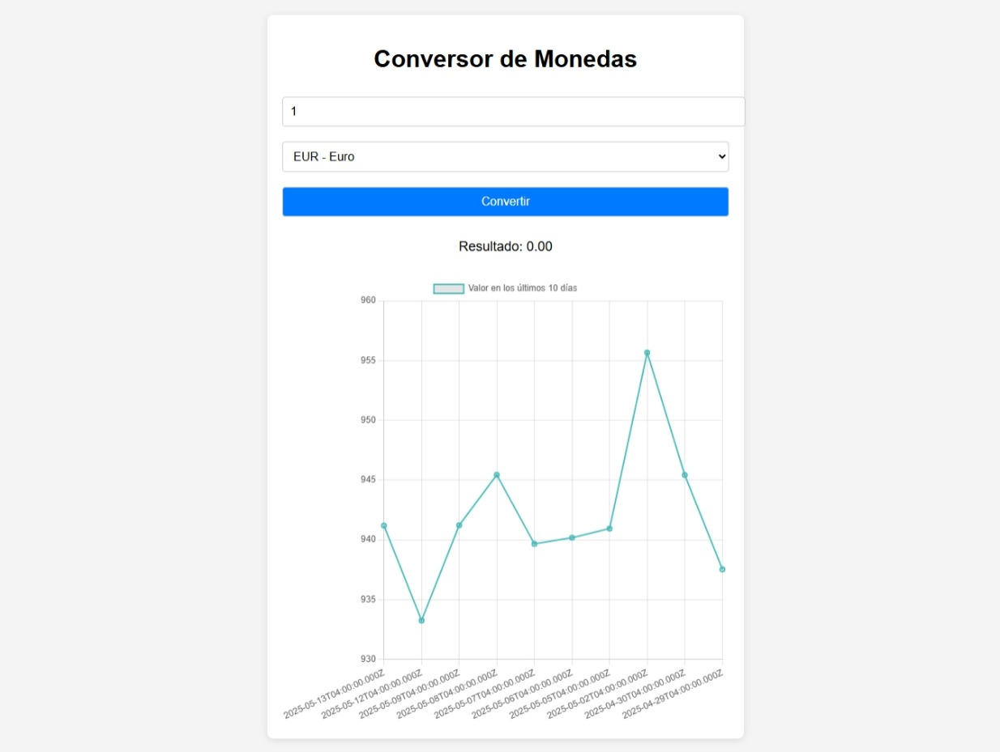

# css-API
# 💱 Conversor de Monedas - Prueba Desafío Latam

Este proyecto es una prueba técnica donde se aplica el método `fetch` para consumir una API y convertir pesos chilenos (CLP) a diferentes monedas extranjeras, mostrando además un gráfico con el historial de los últimos 10 días de la moneda seleccionada.

---

## 🧠 Requisitos evaluados

✅ Obtener los tipos de cambio desde la API de [mindicador.cl](https://mindicador.cl)  
✅ Calcular correctamente el cambio y mostrarlo en el DOM  
✅ Implementar al menos dos tipos de moneda (USD y EUR)  
✅ Usar `try...catch` para manejo de errores y mostrar mensajes en el DOM  
✅ Implementar un gráfico con `Chart.js` para mostrar el historial de los últimos 10 días  

---

## 📸 Captura de pantalla



---

## 🚀 Tecnologías utilizadas

- HTML5
- CSS3
- JavaScript (ES6+)
- [Chart.js](https://www.chartjs.org/) para gráficas
- API pública: [https://mindicador.cl](https://mindicador.cl)

---

## 🧾 Estructura del proyecto
├── index.html
├── assets
│ ├── css
│ │ ├── normalize.css
│ │ └── style.css
│ ├── js
│ │ └── main.js
│ └── img
│ └── captura.png


---

## 🔍 Funcionalidades principales

- Permite ingresar un monto en pesos chilenos.
- Elige entre dos monedas: dólar (USD) y euro (EUR).
- Convierte y muestra el valor en la moneda elegida.
- Muestra el gráfico de evolución de la moneda en los últimos 10 días.
- Muestra errores en el DOM en caso de fallos de conexión o API.

---

## 📦 Cómo usar

1. Clona el repositorio:
   ```bash
   git clone https://github.com/Andreadavj/javascript-API.git
